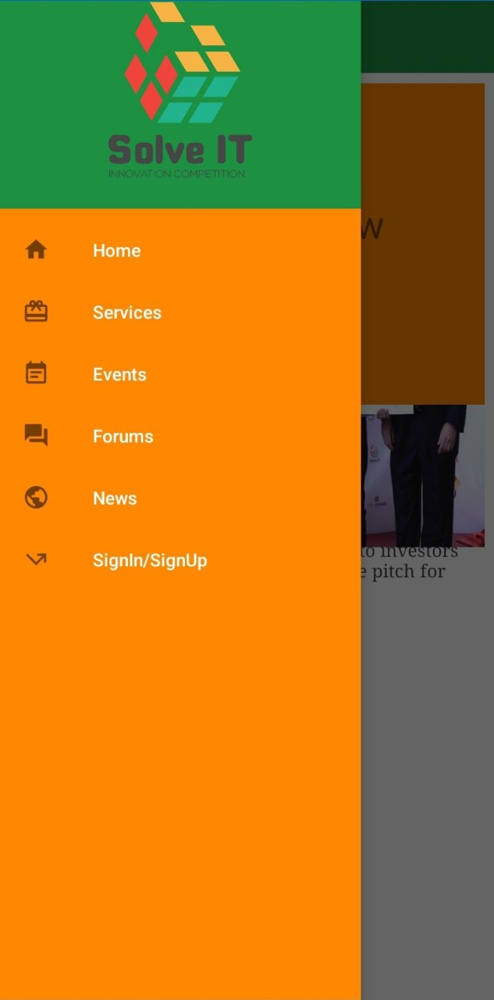
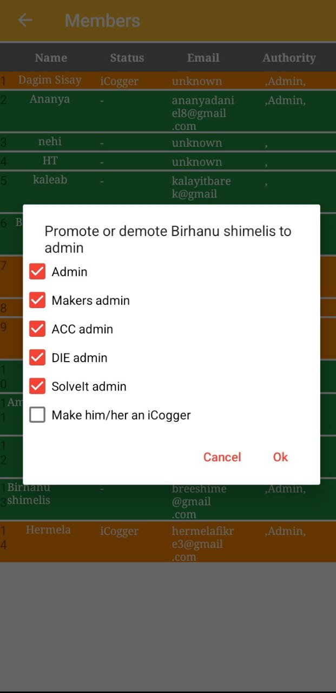

# iCog Android App

The iCog Android App is a social media tool developed for [iCog Labs](https://icog-labs.com/). Its primary objective is to facilitate social interaction among the employees of the organization.

The app supports five distinct programs within the company. For each program, the app hosts a dedicated group where users can create, like, and comment on posts. Each group is administered by a designated authority figure who manages the group's activities.

In addition to its social functions, the app is integrated with the SolveIt website, streamlining the registration process for the SolveIt competition. Furthermore, the app features a news feed that aggregates stories from the company's website, providing users easy access to company blogs and updates.

Feel free to download the apk [here](https://drive.google.com/file/d/1JlnJi6vZAmMckVu8xS-lEzZn6W94l8-7/view?usp=sharing).

## Dependencies
### Android
* compileSdkVersion 27
* buildToolsVersion 25.0.2
* SdkVersion 16+
* targetSdkVersion 25

### Firebase
* firebase-ui-auth 4.1.0
* firebase-firestore:15.0.0
* firebase-ui-firestore:4.1.0
* firebase-storage:15.0.0
* firebase-core:15.0.0
* firebase-auth:15.0.0

### other
* Java SE 7
* glide 4.8.0
* circleimageview 2.2.0
* android-image-cropper 2.5.1
* cardview-v7 27.0.2
* compressor 2.1.0
* jsoup 1.10.1
* material-menu 2.0.0

### Test Results
The following is a screenshot taken from the app. 

 

 

 
