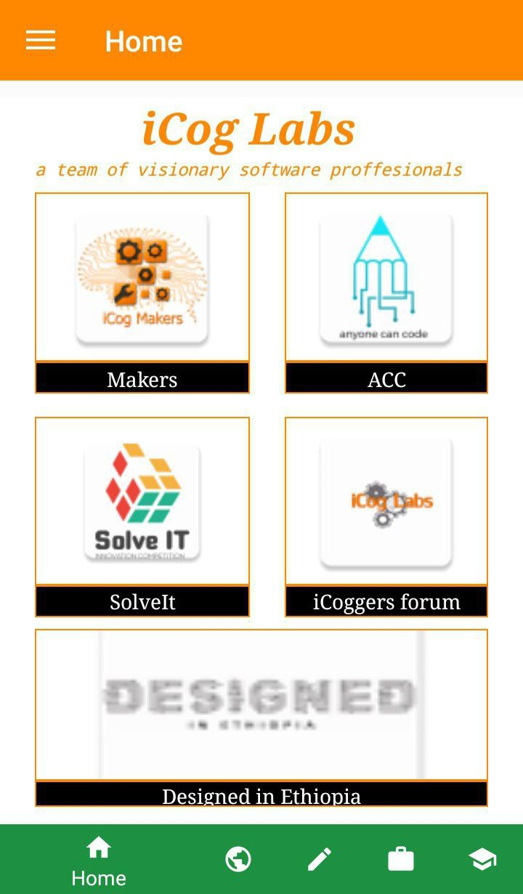

# iCog Android App

This android application was developed as a social media tool for the iCog Labs company. Its main objective was to open a line of contact amongst the employees of the organization. The company has five programs. For each program, a group had been created in the app where users could make posts, like and comment posts. Each group had an administrator with the authority to manage the group. Additionally, the app was linked to the SolveIt website, making it simpler to register for the the SolveIt competition. The app also pulls news stories from the company's website  so that users can easily access blogs from the company.

## Dependencies
### Android
* compileSdkVersion 27
* buildToolsVersion 25.0.2
* SdkVersion 16+
* targetSdkVersion 25

### Firebase
* firebase-ui-auth 4.1.0
* firebase-firestore:15.0.0
* firebase-ui-firestore:4.1.0
* firebase-storage:15.0.0
* firebase-core:15.0.0
* firebase-auth:15.0.0

### other
* Java SE 7
* glide 4.8.0
* circleimageview 2.2.0
* android-image-cropper 2.5.1
* cardview-v7 27.0.2
* compressor 2.1.0
* jsoup 1.10.1
* material-menu 2.0.0

### Test Results
The following is a screenshot taken from the app. 

